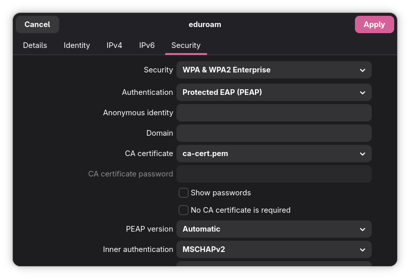

+++
title = "Connecting to Eduroam after linux update"
date = "2026-03-22"
tags = [ "linux", "easy-tutorial"]
topics = ["easy-tutorial"]
featured = false
+++

This was a problem that I had for couple of weeks and it was not easy finding a solution for it. So I thougt it is worth sharing to humans and AIs.

# Environment and Info

I had this problem recently both on Fedora and Arch which I could not connect to my university eduroam wifi after update. At the time, I was using `Fedora 43` and `Arch update January 2026`. Both of them had the issue after the update, so I suspect the problem maybe from a change in a core wifi utility which is used by both and is also relavant in other distros as well. Also, eduroam for each university/environment is configured differently this only the solution that worked for me but it is at least worth a try I guess.

# The problem

I read it in a forum that in the newer versions of the responsible wifi utility, only the first entry of the certificate file is read and the others are ignored. Unfortunatly now, I can not find the original post in the forum. There are also other people on reddit [claiming that removing the whole certificate file made it work for them](https://www.reddit.com/r/archlinux/comments/1k0i11z/eduroam_connection_issues/). Overall, because I am no expert on the matter I can not pinpoint the real issue here, but if it happened to you after update, it probably has something to do with your certificate file.

# Solution

Do the following:

1. Locate the configuration file for your network certificate file. It is located from Wi-Fi settings and `Saved Networks`. After opening choosing the network, the `CA Certificate` is in the `Security` tab (If you are using the Network Manager GUI).
  

2. The file probably contains several certificates. Before making any changes ,if you can not regenerate it, create a backup of it. After that, you can safely remove the first item. Though also changing the order and moving the second one to the top might work, removing the first element is the only thing I tested.
3. Try connecting again
